What Makes a 'Good' Wine?
================
J Steven Raquel
June 14, 2017

Abstract
========

This report pertains to a dataset of physiochemical data of white wine from Portugal, with 4898 observations and 12 initial attributes, 11 of them numeric and 1 of them categorical (quality). We turned `quality` into "good" or "bad" (good being a quality of 5 or above) in order to attempt to classify these observations into one of the two categories using supervised learning techniques such as decision tree, k-nearest neighbor, and randomForest. The ultimate goal is to determine what physiochemical properties of wine constitute a "good" wine, using a variety of algorithmic methods, as well as finding which of these methods produces the best model.

We initially built a more complex decision tree, but used cross-validation afterwards to narrow it to the most relevant predictors. We found that higher values of k in k-nearest neighbors tended to decrease accuracy, but that this was necessary in order to minimize variance and avoid overfitting. randomForest managed to remain accurate while seemingly bypassing issues of overfitting because of the bootstrap aggregating inherent in the technique. The most relevant predictors as given by the randomForest model were consistent with those we saw in our pruned decision tree.

Introduction
============

We use this white wine quality dataset, and all of its attributes (e.g. sulfur dioxide content, pH) to determine what constitutes a "good" (or above average) quality wine. We used the R statistical computing language to conduct the analyses in this report. The data were found on the UC Irvine Machine Learning Repository.

Knowing what makes a good wine was an interesting question because it allows us to look at "taste" in a different way--without formal training in wine tasting, we can determine algorithmically how and why a wine is good using machine learning.

We utilized randomForest, decision trees, and k-nearest neighbors to classify each observation as either good or bad based off of these attributes, while varying the number of variables, nodes, and number of neighbors and comparing within and between these methods.

In this report, we find the accuracy, error rates, and area under the ROC curve (AUC) of each of the three methods and ultimately came to determine that randomForest was the most effective in terms of accuracy and AUC. It works well as a generalization of the decision tree method, and as an algorithm it is robust, but it falls short in terms of interpretability. kNN on the other hand is slow to compute with a dataset of this dimensionality, as well as weaker in its accuracy both in absolute terms and relative to the other methods we have tested here.

Main Body
=========

``` r
set.seed(10)
# Reading in the data
white <- read.csv("winequality-white.csv", sep = ";")

sapply(white, function(x) sum(is.na(x)))
```

    ##        fixed.acidity     volatile.acidity          citric.acid 
    ##                    0                    0                    0 
    ##       residual.sugar            chlorides  free.sulfur.dioxide 
    ##                    0                    0                    0 
    ## total.sulfur.dioxide              density                   pH 
    ##                    0                    0                    0 
    ##            sulphates              alcohol              quality 
    ##                    0                    0                    0

A preliminary look at the dataset reveals that there are no missing values.

First we can look at the correlation matrix of the dataset, to see if any predictors are highly correlated with one another. We may have to take out these predictors in order to avoid multicollinearity, which can invalidate results. Having said this, multicollinearity is less of an issue with decision trees, and even less so with randomForest, both of which are going to be used in this analysis.

``` r
white.cor <- cor(white[,1:12])
white.cor
```

    ##                      fixed.acidity volatile.acidity  citric.acid residual.sugar
    ## fixed.acidity           1.00000000      -0.02269729  0.289180698     0.08902070
    ## volatile.acidity       -0.02269729       1.00000000 -0.149471811     0.06428606
    ## citric.acid             0.28918070      -0.14947181  1.000000000     0.09421162
    ## residual.sugar          0.08902070       0.06428606  0.094211624     1.00000000
    ## chlorides               0.02308564       0.07051157  0.114364448     0.08868454
    ## free.sulfur.dioxide    -0.04939586      -0.09701194  0.094077221     0.29909835
    ## total.sulfur.dioxide    0.09106976       0.08926050  0.121130798     0.40143931
    ## density                 0.26533101       0.02711385  0.149502571     0.83896645
    ## pH                     -0.42585829      -0.03191537 -0.163748211    -0.19413345
    ## sulphates              -0.01714299      -0.03572815  0.062330940    -0.02666437
    ## alcohol                -0.12088112       0.06771794 -0.075728730    -0.45063122
    ## quality                -0.11366283      -0.19472297 -0.009209091    -0.09757683
    ##                        chlorides free.sulfur.dioxide total.sulfur.dioxide
    ## fixed.acidity         0.02308564       -0.0493958591          0.091069756
    ## volatile.acidity      0.07051157       -0.0970119393          0.089260504
    ## citric.acid           0.11436445        0.0940772210          0.121130798
    ## residual.sugar        0.08868454        0.2990983537          0.401439311
    ## chlorides             1.00000000        0.1013923521          0.198910300
    ## free.sulfur.dioxide   0.10139235        1.0000000000          0.615500965
    ## total.sulfur.dioxide  0.19891030        0.6155009650          1.000000000
    ## density               0.25721132        0.2942104109          0.529881324
    ## pH                   -0.09043946       -0.0006177961          0.002320972
    ## sulphates             0.01676288        0.0592172458          0.134562367
    ## alcohol              -0.36018871       -0.2501039415         -0.448892102
    ## quality              -0.20993441        0.0081580671         -0.174737218
    ##                          density            pH   sulphates     alcohol
    ## fixed.acidity         0.26533101 -0.4258582910 -0.01714299 -0.12088112
    ## volatile.acidity      0.02711385 -0.0319153683 -0.03572815  0.06771794
    ## citric.acid           0.14950257 -0.1637482114  0.06233094 -0.07572873
    ## residual.sugar        0.83896645 -0.1941334540 -0.02666437 -0.45063122
    ## chlorides             0.25721132 -0.0904394560  0.01676288 -0.36018871
    ## free.sulfur.dioxide   0.29421041 -0.0006177961  0.05921725 -0.25010394
    ## total.sulfur.dioxide  0.52988132  0.0023209718  0.13456237 -0.44889210
    ## density               1.00000000 -0.0935914935  0.07449315 -0.78013762
    ## pH                   -0.09359149  1.0000000000  0.15595150  0.12143210
    ## sulphates             0.07449315  0.1559514973  1.00000000 -0.01743277
    ## alcohol              -0.78013762  0.1214320987 -0.01743277  1.00000000
    ## quality              -0.30712331  0.0994272457  0.05367788  0.43557472
    ##                           quality
    ## fixed.acidity        -0.113662831
    ## volatile.acidity     -0.194722969
    ## citric.acid          -0.009209091
    ## residual.sugar       -0.097576829
    ## chlorides            -0.209934411
    ## free.sulfur.dioxide   0.008158067
    ## total.sulfur.dioxide -0.174737218
    ## density              -0.307123313
    ## pH                    0.099427246
    ## sulphates             0.053677877
    ## alcohol               0.435574715
    ## quality               1.000000000

Taking a look at the correlation coefficients *r* for the predictor variables, we see that `density` is strongly correlated with `residual.sugar` (*r* = 0.84) and `alcohol` (*r* = −0.78), and moderately correlated with `total.sulfur.dioxide` (*r* = 0.53). `free.sulfur.dioxide` and `total.sulfur.dioxide` are also moderately correlated with each other (*r* = 0.62) although this is trivially known because of course, free sulfur dioxide is incorporated into the total sulfur dioxide.

Aside from that correlations are all very low, including (and especially) `quality`, the response variable, with the predictors.

So, we should actually remove the variables `residual.sugar` and `density`, as well as `total.sulfur.dioxide` because if its direct relationship with `free.sulfur.dioxide`, in order to address problems with multicollinearity. We're going to withhold removing `alcohol`, to see the if the initial effect of removing just these three correlated variables is enough to address the issue.

``` r
# removing three predictors
white2 <- subset(white, select = -c(4,7,8))
cor(white2[,1:9])
```

    ##                     fixed.acidity volatile.acidity  citric.acid   chlorides
    ## fixed.acidity          1.00000000      -0.02269729  0.289180698  0.02308564
    ## volatile.acidity      -0.02269729       1.00000000 -0.149471811  0.07051157
    ## citric.acid            0.28918070      -0.14947181  1.000000000  0.11436445
    ## chlorides              0.02308564       0.07051157  0.114364448  1.00000000
    ## free.sulfur.dioxide   -0.04939586      -0.09701194  0.094077221  0.10139235
    ## pH                    -0.42585829      -0.03191537 -0.163748211 -0.09043946
    ## sulphates             -0.01714299      -0.03572815  0.062330940  0.01676288
    ## alcohol               -0.12088112       0.06771794 -0.075728730 -0.36018871
    ## quality               -0.11366283      -0.19472297 -0.009209091 -0.20993441
    ##                     free.sulfur.dioxide            pH   sulphates     alcohol
    ## fixed.acidity             -0.0493958591 -0.4258582910 -0.01714299 -0.12088112
    ## volatile.acidity          -0.0970119393 -0.0319153683 -0.03572815  0.06771794
    ## citric.acid                0.0940772210 -0.1637482114  0.06233094 -0.07572873
    ## chlorides                  0.1013923521 -0.0904394560  0.01676288 -0.36018871
    ## free.sulfur.dioxide        1.0000000000 -0.0006177961  0.05921725 -0.25010394
    ## pH                        -0.0006177961  1.0000000000  0.15595150  0.12143210
    ## sulphates                  0.0592172458  0.1559514973  1.00000000 -0.01743277
    ## alcohol                   -0.2501039415  0.1214320987 -0.01743277  1.00000000
    ## quality                    0.0081580671  0.0994272457  0.05367788  0.43557472
    ##                          quality
    ## fixed.acidity       -0.113662831
    ## volatile.acidity    -0.194722969
    ## citric.acid         -0.009209091
    ## chlorides           -0.209934411
    ## free.sulfur.dioxide  0.008158067
    ## pH                   0.099427246
    ## sulphates            0.053677877
    ## alcohol              0.435574715
    ## quality              1.000000000

From the new correlation matrix it appears that none of the predictors now have too high or a correlation with each other, and we can decide that multicollinearity is no longer an issue.

From here on out, we're also going to want to convert the `quality` response variable into a binary factor so that we can use the predictors to classify the observations. We're going to do this by labeling all of the observations that have received an above average (5 out of 10) as "good", and the rest as "bad", "bad" really meaning "not good". This factor of `good` and `bad` goes under a new column titled `label`.

We'll remove the `quality` variable afterwards, since if we use it as an attribute in the predictor, it will skew the results because it is directly correlated to the label.

It's important to note that all of these numeric predictor variables (`fixed.acidity`, `volatile.acidity`, `citric.acid`, `chlorides`, `free.sulfur.dioxide`, `pH`, `sulphates`, `alcohol`) are not all scaled the same. As such, it's appropriate to scale them before running any analyses.

``` r
# scaling the 8 numeric attributes
white_sc <- white2
white_sc[,c(1:8)] <- scale(white_sc[,c(1:8)])

# converting quality into a binary factor
for (i in 1:nrow(white_sc)) {
  if (white_sc$quality[i] > 5)
    white_sc$label[i] <- 1
  else
    white_sc$label[i] <- 0
}
white_sc$label <- factor(white_sc$label, levels = c(0, 1), labels = c("bad", "good"))
# removing the quality variable
white_sc$quality <- NULL
```

Now we have 8 numeric predictor variables, and one two-level categorical variable (`label`). We're going to apply a few different classification methods in order to firstly determine which the best model for predicting is in terms of the relevant variables, and secondly to find the best classification algorithm for this data.

We're going to initialize a matrix to easily compare the quality of the different classification methods we're going to utilize going forward, namely decision trees (with k-fold cross validation to prune the tree), k-nearest neighbor, and randomForest. The 'full randomForest' refers to the model using all 8 predictors whereas the 'small randomForest' refers to a subset of these predictors, the use of which will become clear when discussing decision trees.

``` r
# initializing a matrix for records
records <- matrix(NA, nrow = 6, ncol = 3)
colnames(records) <- c("Accuracy Rate", "Error Rate", "AUC")
rownames(records) <- c("tree", "pruned.tree", "k=10 kNN", "k=35 kNN", "full.randomForest", "small.randomForest")
records
```

    ##                    Accuracy Rate Error Rate AUC
    ## tree                          NA         NA  NA
    ## pruned.tree                   NA         NA  NA
    ## k=10 kNN                      NA         NA  NA
    ## k=35 kNN                      NA         NA  NA
    ## full.randomForest             NA         NA  NA
    ## small.randomForest            NA         NA  NA

In order to apply machine learning algorithms to this dataset, we need to stratify the dataset into a training set and a test set. The first set will be used to teach the classification model how to predict, depending on the algorithm chosen. We then apply the algorithm to the test set, and see how accurate the classification was.

``` r
# set.seed(10) is loaded
# using a subset of 1000 obs for the training set
test_indices <- sample(1:nrow(white_sc), 1000)
test <- white_sc[test_indices,]
train <- white_sc[-test_indices,]
```

Decision Tree
-------------

The first method we are going to perform on this dataset, is Decision Trees. Decision tree is a non-parametric classification method, which uses a set of rules to predict that each observation belongs to the most commonly occurring class label of training data.

Of course, we're going to use `label` as a response variable, and each of the now 8 remaining numeric attributes as predictors.

``` r
# library(tree) is loaded
# predicting the label (good vs bad)
tree <- tree(formula = label ~ ., data = train, 
             method = "class",
             control = tree.control(nobs = nrow(train),
                                          mincut = 5,
                                          minsize = 10,
                                          mindev = .003))
summary(tree)
```

    ## 
    ## Classification tree:
    ## tree(formula = label ~ ., data = train, control = tree.control(nobs = nrow(train), 
    ##     mincut = 5, minsize = 10, mindev = 0.003), method = "class")
    ## Variables actually used in tree construction:
    ## [1] "alcohol"             "volatile.acidity"    "free.sulfur.dioxide"
    ## [4] "chlorides"           "sulphates"           "fixed.acidity"      
    ## [7] "citric.acid"        
    ## Number of terminal nodes:  16 
    ## Residual mean deviance:  0.9588 = 3722 / 3882 
    ## Misclassification error rate: 0.2324 = 906 / 3898

So we can see from this summary, that in fact 6 out of the 8 predictors were used in constructing this tree: `alcohol`, `volatile.acidity`, `free.sulfur.dioxide`, `sulphates`, `citric.acid`, and `fixed.acidity`. Now we are actually going to plot the tree to visualize this.

``` r
plot(tree, type = "uniform")
text(tree, pretty = 0, cex = 1, col = "red")
title("Classification Tree (Before Pruning)")
```

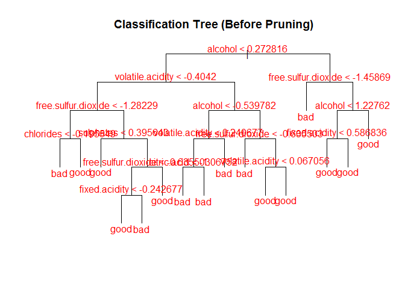

We can see while looking at the tree how often `alcohol` appears and intuit from that that the amount of alcohol, whether high or low, plays at least some part in the model's classification of a good wine.

We can build a confusion matrix after using the data to predict on the test set, and then find the accuracy rate and the error rate.

``` r
# a function that returns the accuracy of a confusion matrix
class_acc <- function(conf) {
  sum(diag(conf)) / sum(conf)
}

tree_pred <- predict(tree, test, type = "class")

# confusion matrix
tree_conf <- table(pred = tree_pred, true = test$label)
tree_conf
```

    ##       true
    ## pred   bad good
    ##   bad  225  118
    ##   good 133  524

``` r
# the class_acc() function is defined locally
tree_acc <- class_acc(tree_conf)
tree_acc
```

    ## [1] 0.749

``` r
# misclassification error 
tree_err <- 1 - tree_acc
tree_err
```

    ## [1] 0.251

With an accuracy rate of `0.748`, this decision tree model is not superb, but will still classify correctly about 3 out of 4 times.

As an alternative metric to quantify the robustness of this method, we can use the Receiver Operating Characteristic (ROC) curve and the area underneath it (AUC). The ROC curve plots the false positive rate against the true positive rate, and the area underneath it falls between either 0.5 or 1, 0.5 being the worst (random classification), and 1 being the best (perfect classification).

``` r
# library(ROCR) is loaded
# getting matrix of predicted class probabilities
all_tree_probs <- as.data.frame(predict(tree, test, type = "vector"))
tree_probs <- all_tree_probs[,2]

tree_roc_pred <- prediction(tree_probs, test$label)
tree_roc_perf <- performance(tree_roc_pred, "tpr", "fpr")

# Plotting the ROC curve for the decision tree
plot(tree_roc_perf, col = 2, lwd = 3, 
     main = "ROC Curve for tree (before pruning)")
abline(0,1)
```

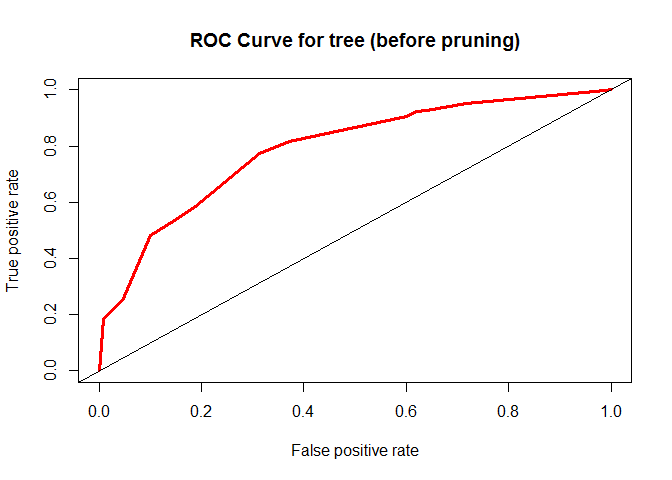

``` r
# Area under the curve
tree_auc_perf <- performance(tree_roc_pred, "auc")
tree_AUC <- tree_auc_perf@y.values[[1]]
tree_AUC
```

    ## [1] 0.7885253

``` r
# adding to records matrix
records[1, ] <- c(tree_acc, tree_err, tree_AUC)
records
```

    ##                    Accuracy Rate Error Rate       AUC
    ## tree                       0.749      0.251 0.7885253
    ## pruned.tree                   NA         NA        NA
    ## k=10 kNN                      NA         NA        NA
    ## k=35 kNN                      NA         NA        NA
    ## full.randomForest             NA         NA        NA
    ## small.randomForest            NA         NA        NA

We see thusly that the area under the curve is 0.788 which is slightly closer to 1 than 0.5. That is to say that it is more good than bad, but hardly so.

### k-fold Cross Validation

We can use k-fold cross-validation, which randomly partitions the dataset into folds of similar size, to see if the tree requires any pruning which can improve the model's accuracy as well as make it more interpretable for us.

In k-fold cross validation, we divide the sample into `k` sub samples, then train the model on `k -1` samples, leaving one as a holdout sample. We compute validation error on each of these samples, then average the validation error of all of them.

The idea of cross-validation is that it will sample multiple times from the training set, with different separations. Ultimately, this creates a more robust model i.e. the tree will not be overfit.

Cross validation will help us find the optimal size for the tree (in terms of number of nodes). We can plot the size against misclassification error to visualize this as well.

``` r
set.seed(10)
# 10-fold CV (k = 10)
# library(tree) is loaded
cv <- cv.tree(tree, FUN=prune.misclass, K=10)
cv
```

    ## $size
    ## [1] 16 11  8  7  6  5  4  3  1
    ## 
    ## $dev
    ## [1] 1004 1004 1004 1013 1013 1007  997 1057 1205
    ## 
    ## $k
    ## [1]       -Inf   0.000000   1.333333   6.000000   7.000000  10.000000  40.000000
    ## [8]  77.000000 116.000000
    ## 
    ## $method
    ## [1] "misclass"
    ## 
    ## attr(,"class")
    ## [1] "prune"         "tree.sequence"

``` r
# Best size 
best.cv <- cv$size[which.min(cv$dev)]

# plotting misclass error as a function of tree size (k)
plot(cv$size , cv$dev, type="b", 
     xlab = "Number of leaves, \'best\'", 
     ylab = "Misclassification Error",
     col = "red", main="Optimal Tree Size")
abline(v=best.cv, lty=2)
```

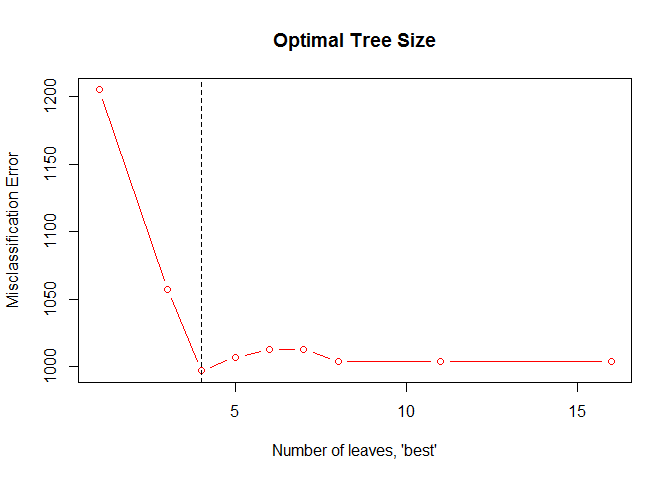

``` r
best.cv
```

    ## [1] 4

So we see, after running cross-validation, we see that we should prune the tree so that it has only 7 nodes. With this knowledge we can prune the tree and run the same diagnostics on it that we did on the unpruned model to see if any improvements are apparent.

``` r
tree.pruned <- prune.tree(tree, best = best.cv, 
                          method = "misclass")
summary(tree.pruned)
```

    ## 
    ## Classification tree:
    ## snip.tree(tree = tree, nodes = c(10L, 3L, 4L, 11L))
    ## Variables actually used in tree construction:
    ## [1] "alcohol"          "volatile.acidity"
    ## Number of terminal nodes:  4 
    ## Residual mean deviance:  1.054 = 4103 / 3894 
    ## Misclassification error rate: 0.2496 = 973 / 3898

``` r
plot(tree.pruned, type = "uniform")
text(tree.pruned, col = "blue")
title("Pruned Classification Tree")
```

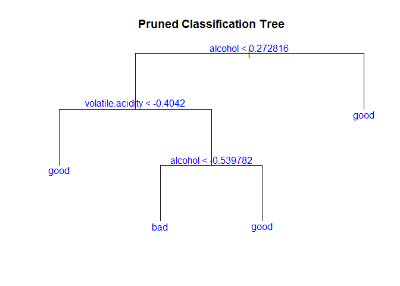

Note that after pruning the tree, the only relevant variables used in tree construction are: `alcohol`, `volatile.acidity`, and `free.sulfur.dioxide`. And of course, this tree only has 7 nodes, the best tree size we determined from using cross-validation.

Now we can apply the same diagnostic methods as before: looking at confusion matrix, accuracy/error rate, the ROC curve and the area underneath it, for the sake of comparison.

``` r
pruned_pred <- predict(tree.pruned, test, type = "class")
# confusion matrix
pruned_conf <- table(pred = pruned_pred, true = test$label)
pruned_conf
```

    ##       true
    ## pred   bad good
    ##   bad  179   88
    ##   good 179  554

``` r
pruned_acc <- class_acc(tree_conf)
pruned_acc
```

    ## [1] 0.749

``` r
pruned_err <- 1 - tree_acc
pruned_err
```

    ## [1] 0.251

We see that pruning the tree didn't actually really improve the accuracy rate of the model at all, although it did condense the number of relevant variables. Initially, seeing that accuracy did not improve might give the impression that pruning was not meaningful, but to the contrary, the fact that we were able to prune the tree without losing any accuracy shows that the sole 3 variables we have remaining (`alcohol`, `volatile.acidity`, and `free.sulfur.dioxide`) are just as good as classifying when using a decision tree as when using all 8 predictors.

The original model being rather complex with as many as 6 predictors runs the risk of over-fitting, which is to say that the data follows the training data too closely and cannot be well generalized to new data. This is why we are inclined to favor a simpler model such as that we found after pruning with cross-validation.

``` r
# ROC Curve with tree object
# getting matrix of predicted class probabilities
all_pruned_probs <- as.data.frame(predict(tree.pruned, test, type = "vector"))
pruned_probs <- all_pruned_probs[,2]

pruned_roc_pred <- prediction(pruned_probs, test$label)
pruned_roc_perf <- performance(pruned_roc_pred, "tpr", "fpr")

# Plotting the ROC curve for the rpart decision tree
plot(pruned_roc_perf, col = 2, lwd = 3, 
     main = "ROC Curve for Pruned tree")
abline(0,1)
```

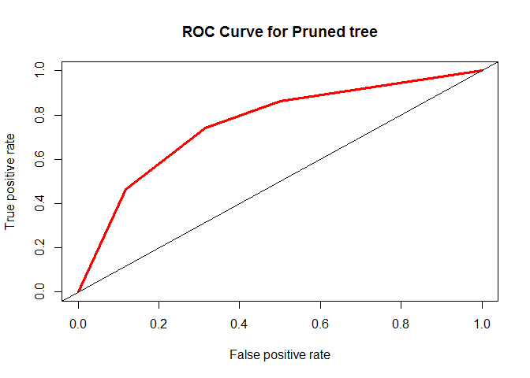

``` r
pruned_auc_perf <- performance(pruned_roc_pred, "auc")
pruned_AUC <- pruned_auc_perf@y.values[[1]]
pruned_AUC
```

    ## [1] 0.7604509

``` r
records[2, ] <- c(pruned_acc, pruned_err, pruned_AUC)
records
```

    ##                    Accuracy Rate Error Rate       AUC
    ## tree                       0.749      0.251 0.7885253
    ## pruned.tree                0.749      0.251 0.7604509
    ## k=10 kNN                      NA         NA        NA
    ## k=35 kNN                      NA         NA        NA
    ## full.randomForest             NA         NA        NA
    ## small.randomForest            NA         NA        NA

So while the accuracy and error rates are virtually unchanged, the area under the curve (AUC) has slightly decreased. It's not a substantial decrease, but one could argue that it has overall made the model worse. Conversely it could be argued that the strength of the model is relatively preserved while reducing the number of variables included. This is good because it gives us a better idea of what the important variables are when it comes to classifying the wines.

Now we have added both the original and the pruned tree's respective error rates and AUC's to the records matrix, and we can proceed to the next method of classification.

k-Nearest Neighbors (kNN)
-------------------------

We're now going to apply the k-nearest neighbors method of classification, which is a non-parametric method. k-Nearest neighbors (or kNN) is called a "lazy learning" technique because it goes through the training set every time it predicts a test sample's label. It finds this label by plotting the test sample in the same dimensional space as the training data, then classifies it based on the "k nearest neighbor(s)", i.e. if k = 10, then the label of the 10 nearest neighbors in the training data to the test data observation will be applied to that observation.

Distance is measured in different ways, but by default the `knn()` function utilized Euclidean distance.

This is rather problematic because when calculating distance it's assumed that attributes have the same effect, while this is not generally true. So the distance metric (Euclidean distance in this case) does not take into account the attributes' relationships with each other, which can result in misclassification. So already we have determined a shortcoming in the kNN method before we have even applied it. Although of course, we already dropped the predictors that were highly correlated with each other, and what's more we scaled the remaining numeric predictors, which goes in a small way to addressing this.

``` r
set.seed(10)
# library(class) is loaded
# using 20 nearest neighbors
knn_pred <- knn(train = train[,-9], 
                test = test[,-9], 
                cl = train$label, 
                k = 10, prob = TRUE)

# confusion matrix
knn_conf <- table(pred = knn_pred, true = test$label)
knn_conf
```

    ##       true
    ## pred   bad good
    ##   bad  205   91
    ##   good 153  551

``` r
# accuracy
knn_acc <- class_acc(knn_conf)
knn_acc
```

    ## [1] 0.756

``` r
# misclassification error
knn_err <- 1 - knn_acc
knn_err
```

    ## [1] 0.244

So, using 10 nearest neighbors was just a random estimate, and it ended up with another mediocre accuracy rate (0.765) but we can look at the area under the ROC curve (AUC) and look at the strength of the test relative to the methods we have tried so far.

``` r
# Creating the ROC curve for knn
# library(dplyr) is loaded
knn_prob <- attr(knn_pred, "prob")
knn_prob <- 2 * ifelse(knn_pred == "-1", 1-knn_prob, knn_prob) - 1
knn_roc_pred <- prediction(predictions = knn_prob, labels = test$label)
knn_roc_perf <- performance(knn_roc_pred, 
                            measure = "tpr", x.measure = "fpr")

# Plotting the KNN ROC curve
plot(knn_roc_perf, col = 2, lwd = 3, 
     main = "ROC Curve for kNN, k = 10")
abline(0,1)
```

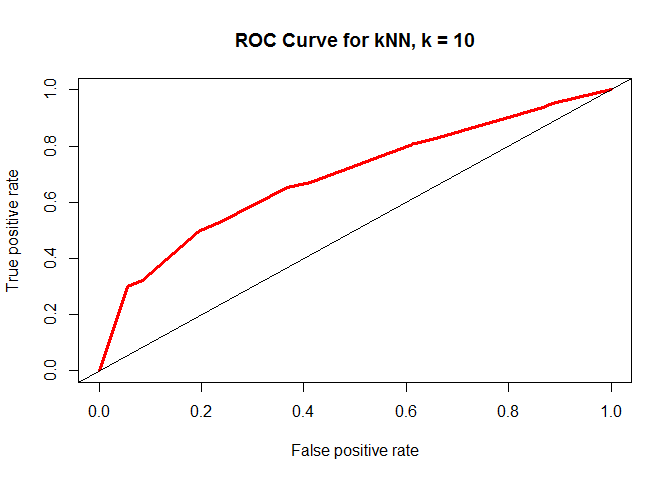

``` r
# Area under the knn curve
knn_auc_perf <- performance(knn_roc_pred, measure = "auc")
knn_AUC <- knn_auc_perf@y.values[[1]]
knn_AUC
```

    ## [1] 0.6893241

``` r
records[3, ] <- c(knn_acc, knn_err, knn_AUC)
records
```

    ##                    Accuracy Rate Error Rate       AUC
    ## tree                       0.749      0.251 0.7885253
    ## pruned.tree                0.749      0.251 0.7604509
    ## k=10 kNN                   0.756      0.244 0.6893241
    ## k=35 kNN                      NA         NA        NA
    ## full.randomForest             NA         NA        NA
    ## small.randomForest            NA         NA        NA

So with an AUC of 0.679, this test is not very good. We can look at different values for *k* and try to find the best one to use and then compare the results from that with these.

``` r
set.seed(10)
# library 'class' is loaded
range <- 1:50
knn_accs <- rep(0, length(range))

# Determining the best k for k-nearest neighbors classification
for (k in range) {
  knn_pred <- knn(train = train[,-9], 
                  test = test[,-9], 
                  cl = train$label, 
                  k = k, prob = TRUE)
  knn_conf <- table(pred = knn_pred, true = test$label)
  knn_accs[k] <- class_acc(knn_conf)
}

# plotting k vs accuracy
plot(range, knn_accs, xlab = "k", ylab = "accuracy",
     main = "Number of Neighbors (k) vs Test Accuracy")
```

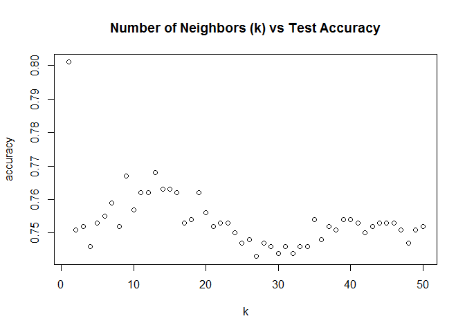 This is interesting because accuracy seems to follow a slight negative trend but overall there are huge jumps in accuracy when incrementing only by 1. We know well that using *k* = 1 will result in a very low bias and high variance, and this also means that we are fitting too closely to the training dataset and therefore, overfitting. This makes for a bad model that cannot be well generalized to new data.

Here is the ROC curve demonstrating this.

``` r
worst_knn_pred <- knn(train = train[,-9], 
                test = test[,-9], 
                cl = train$label, 
                k = 1, 
                prob = TRUE)
worst_knn_prob <- attr(worst_knn_pred, "prob")
worst_knn_prob <- 2*ifelse(worst_knn_pred == "-1", 1-worst_knn_prob, worst_knn_prob)-1
worst_knn_roc_pred <- prediction(predictions = worst_knn_prob, 
                                labels = test$label)
worst_knn_roc_perf <- performance(worst_knn_roc_pred, measure = "tpr", x.measure = "fpr")

# Plotting the KNN ROC curve
plot(worst_knn_roc_perf, col = 2, lwd = 3, 
     main = "ROC Curve for kNN, k = 1")
abline(0,1)
```

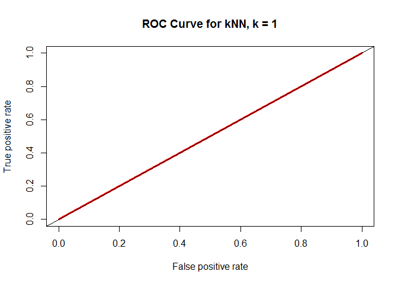

So we think better not to opt for *k* = 1 and rather choose some *k* like 35, which is still decently accurate, and probably less biased.

``` r
# library(knn) is loaded
new_knn_pred <- knn(train = train[,-9], 
                test = test[,-9], 
                cl = train$label, 
                k = 35, 
                prob = TRUE)

# confusion matrix
new_knn_conf <- table(true = test$label, pred = new_knn_pred)
new_knn_conf
```

    ##       pred
    ## true   bad good
    ##   bad  197  161
    ##   good  84  558

``` r
# accuracy rate
new_knn_acc <- class_acc(new_knn_conf)
new_knn_acc
```

    ## [1] 0.755

``` r
# misclassification error rate
new_knn_err <- 1 - new_knn_acc
new_knn_err
```

    ## [1] 0.245

Using *k* = 35 gives a slight increase in test accuracy relative to *k* = 10, although it is not very significant. Now let's look at the ROC curve and the AUC to make our final comparison, both with the *k* = 10 model, and the decision trees.

``` r
# Creating the ROC curve for knn
# library(dplyr) is loaded
new_knn_prob <- attr(new_knn_pred, "prob")
new_knn_prob <- 2*ifelse(new_knn_pred == "-1", 1-new_knn_prob, new_knn_prob)-1
new_knn_roc_pred <- prediction(predictions = new_knn_prob, 
                                labels = test$label)
new_knn_roc_perf <- performance(new_knn_roc_pred, measure = "tpr", x.measure = "fpr")

# Plotting the KNN ROC curve
plot(new_knn_roc_perf, col = 2, lwd = 3, 
     main = "ROC Curve for kNN, k = 35")
abline(0,1)
```

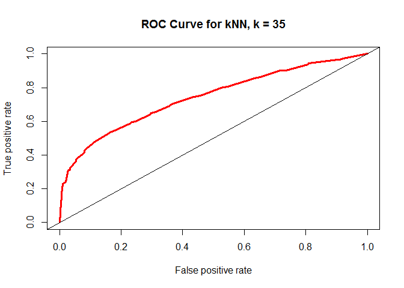

``` r
# Area under the knn curve
new_knn_auc_perf <- performance(new_knn_roc_pred, measure = "auc")
new_knn_AUC <- new_knn_auc_perf@y.values[[1]]
new_knn_AUC
```

    ## [1] 0.7414004

``` r
records[4,] <- c(new_knn_acc, new_knn_err, new_knn_AUC)
records
```

    ##                    Accuracy Rate Error Rate       AUC
    ## tree                       0.749      0.251 0.7885253
    ## pruned.tree                0.749      0.251 0.7604509
    ## k=10 kNN                   0.756      0.244 0.6893241
    ## k=35 kNN                   0.755      0.245 0.7414004
    ## full.randomForest             NA         NA        NA
    ## small.randomForest            NA         NA        NA

So we see that although we have sacrified some accuracy, the area under the curve has increased somewhat, so it could be argued that the test has improved. What's more, with a dataset of this dimensionality, it is most likely better to use more neighbors if one can, because otherwise you run the risk of overfitting to the training data (which is why we did not opt for *k* = 1.)

So we see actually that while kNN is slightly more accurate than decision trees, the area under the ROC curve is worsened which makes it a worse test. Also, kNN is computationally rather expensive and it gets to be very complex when dealing with datasets with high dimensions (this dataset has nearly 5000 rows), so we think to rule out k-nearest neighbors when deciding what the best method of classification is.

Finally we can move on to the final method of classification, randomForest.

randomForest
------------

randomForest is similar to the decision tree method in that it builds trees, hence the name 'random Forest'. This is an ensemble learning method which creates a multitude of decision trees, and outputting the class that occurs most frequently among them. The advantage that randomForest has over decision trees is the element of randomness which guards against the pitfall of overfitting that decision trees run into on their own.

``` r
### Random Forest
# using all 8 predictor attributes, on the training set
rf <- randomForest(formula = label ~ .,
                   data = train,
                   mtry = 8)

print(rf)
```

    ## 
    ## Call:
    ##  randomForest(formula = label ~ ., data = train, mtry = 8) 
    ##                Type of random forest: classification
    ##                      Number of trees: 500
    ## No. of variables tried at each split: 8
    ## 
    ##         OOB estimate of  error rate: 16.96%
    ## Confusion matrix:
    ##      bad good class.error
    ## bad  896  386   0.3010920
    ## good 275 2341   0.1051223

``` r
# Variable Importance Plot
varImpPlot(rf, main = "Variable Importance Plot")
```

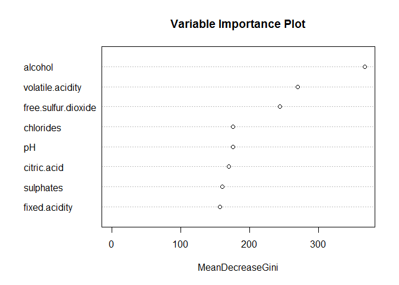

`meanDecreaseGini` refers to the "mean decrease in node impurity". Impurity is a way that the optimal condition of a tree is determined, and this plot shows how each variable individually affects the weighted impurity of the tree itself.

randomForest used all 8 of the predictor variables. This variable importance plot shows how 'important' each variable was in determining the classification. We can see that, consistent with the pruned decision tree, that `alcohol`, `volatile.acidity`, and `free.sulfur.dioxide` are the three most important predictors.

``` r
# predicting on the test set
rf_pred <- predict(rf, test, type = "class")

# Confusion Matrix
rf_conf <- table(true = test$label, pred =  rf_pred)
rf_conf
```

    ##       pred
    ## true   bad good
    ##   bad  251  107
    ##   good  67  575

``` r
rf_acc <- class_acc(rf_conf)
rf_acc
```

    ## [1] 0.826

``` r
rf_err <- 1 - rf_acc
rf_err
```

    ## [1] 0.174

With an accuracy rate of `0.823`, this randomForest model is looking pretty good so far, and it already is more accurate than any method we've tried thus far.

Let's take a look at the ROC curve and the area underneath it.

``` r
# Building the ROC Curve
rf_pred <- as.data.frame(predict(rf, newdata = test, type = 'prob'))
rf_pred_probs <- rf_pred[,2]
rf_roc_pred <- prediction(rf_pred_probs, test$label)
rf_perf <- performance(rf_roc_pred, measure = "tpr", 
                       x.measure = "fpr")

# Plotting the curve
plot(rf_perf, col = 2, lwd = 3, 
     main = "ROC Curve for randomForest with 8 variables")
abline(0,1)
```

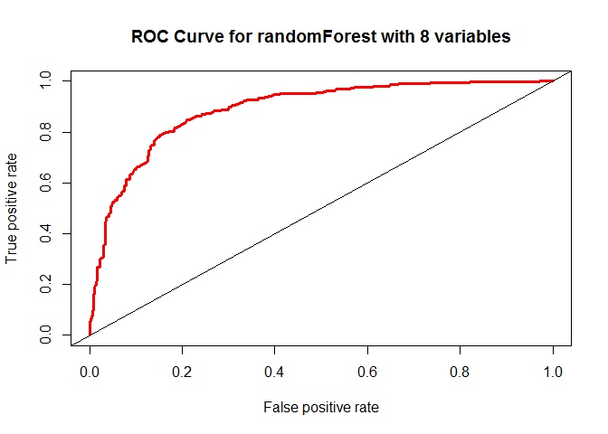

``` r
# Area under the curve
rf_perf2 <- performance(rf_roc_pred, measure = "auc")
rf_AUC <- rf_perf2@y.values[[1]]
rf_AUC
```

    ## [1] 0.8891906

``` r
records[5, ] <- c(rf_acc, rf_err, rf_AUC)
records
```

    ##                    Accuracy Rate Error Rate       AUC
    ## tree                       0.749      0.251 0.7885253
    ## pruned.tree                0.749      0.251 0.7604509
    ## k=10 kNN                   0.756      0.244 0.6893241
    ## k=35 kNN                   0.755      0.245 0.7414004
    ## full.randomForest          0.826      0.174 0.8891906
    ## small.randomForest            NA         NA        NA

The area under the ROC curve for randomForest is `0.887`, which is also a strong AUC for a classification model.

So we see actually that randomForest stands head and shoulders above the other two methods, decision tree and k-nearest neighbors. This is seen in the fact that the accuracy rate, as well as the AUC, are the highest. Judging from this, we can assume that randomForest would be the most likely to correctly classify a wine based off of the attributes and data given.

Recall that earlier we determined in the decision tree that the relevant variables were: `alcohol`, `volatile.acidity`, and `free.sulfur.dioxide`. While this randomForest model was pretty effective in utilizing all of the 8 predictors, we can take a look at a model using only these 3 as well for the sake of comparison.

We have established by now that simpler models have a reduced bias and complexity, but higher variance and a higher chance of underfitting, whereas complex models (such as the full model) have the opposite issue. The good thing about randomForest is that it inherently accounts for this "Bias-Variance" tradeoff by introducing randomness with bagging (bootstrap aggregating).

The question here is whether or not making the model simpler is worthwhile, but we can build the simple model and compare their metrics to find out.

``` r
rf2 <- randomForest(formula = label ~ alcohol + volatile.acidity + free.sulfur.dioxide,
                   data = train,
                   mtry = 3)
# predicting on the test set
rf_pred2 <- predict(rf2, test, type = "class")

# Confusion Matrix
rf_conf2 <- table(test$label, rf_pred2)
rf_conf2
```

    ##       rf_pred2
    ##        bad good
    ##   bad  232  126
    ##   good  71  571

``` r
rf_acc2 <- class_acc(rf_conf2)
rf_acc2
```

    ## [1] 0.803

``` r
rf_err2 <- 1 - rf_acc2
rf_err2
```

    ## [1] 0.197

``` r
# Building the ROC Curve
rf_pred2 <- as.data.frame(predict(rf2, test, type = 'prob'))
rf_pred_probs2 <- rf_pred2[,2]
rf_roc_pred2 <- prediction(rf_pred_probs2, test$label)
rf_perf2 <- performance(rf_roc_pred2, 
                        measure = "tpr", 
                        x.measure = "fpr")

# Plotting the curve
plot(rf_perf2, col = 2, lwd = 3, 
     main = "ROC Curve for randomForest with 3 variables")
abline(0,1)
```

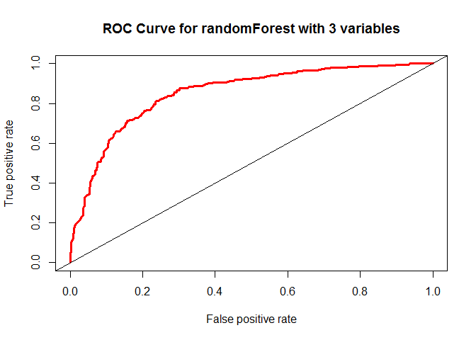

``` r
# Area under the curve
rf_perf22 <- performance(rf_roc_pred2, measure = "auc")
rf_AUC2 <- rf_perf22@y.values[[1]]
rf_AUC2
```

    ## [1] 0.8515354

``` r
records[6,] <- c(rf_acc2, rf_err2, rf_AUC2)
records
```

    ##                    Accuracy Rate Error Rate       AUC
    ## tree                       0.749      0.251 0.7885253
    ## pruned.tree                0.749      0.251 0.7604509
    ## k=10 kNN                   0.756      0.244 0.6893241
    ## k=35 kNN                   0.755      0.245 0.7414004
    ## full.randomForest          0.826      0.174 0.8891906
    ## small.randomForest         0.803      0.197 0.8515354

The accuracy rate has actually decreased, as well as the area under the curve, but not significantly. We're managed to actually preserve the strength of the model, both in relation to the tree and knn methods, but also relative to the original application of randomForest with all of the predictors.

As such, we can opt to utilize this much smaller model for classification instead if we are concerned about complexity and bias. Having said that, because of the randomization introduced in the randomForest, it is inherently more robust so subsetting in this manner may even be unnecessary.

Conclusion
==========

So judging from all of our findings, we have seen that in this case, randomForest is the best algorithm (out of the three we've compared) for classifying this wine dataset. So we have answered the question of what among these three classification algorithms is truly the best.

The decision tree algorithm is useful but ultimately, randomForest is superior version of it since it aggregates many decision trees to create an optimized model that is not susceptible to overfitting. When it comes to interpretability however, a decision tree is preferred. When using a decision tree however it is important to use cross-validation to prune the tree in order to narrow it down to the most important variables.

Compared to decision trees, the k-nearest neighbor algorithm has a slightly greater accuracy rate but a worse AUC. The decision tree method did however help to narrow down the three most relevant attributes: `alcohol`, `volatile.acidity`, and `free.sulfur.dioxide`. This finding was consistent with when we took a look at the most important variables in the randomForest model.

We were able to apply this subset of attributes to the randomForest algorithm and come out with a strong model that only utilizes a few independent variables in order to classify at a high success rate. This lends strength to the argument that these three variables are the most relevant when it comes to determining the content of a good wine.

As far as what these variables' importance is in reality, is that sulfur dioxide is crucial for killing bacteria in wine when creating it. On the other hand, volatile acidity is an undesired trait in wine that affects flavor, that can be caused by such bacteria. So it makes sense that wine that is high in sulfur dioxide, and low in volatile acidity, is considered good.

The pending questions that remain are, did we overfit or underfit to the training data when testing these different classification methods? It is also worth determining exactly the threshold for the amounts of these variables such as `alcohol`, for example finding the optimal amount of alcohol content to create a good wine.

We would also like to delve more into how best to select some *k* for kNN that maintains a high level of accuracy while also having a balance between bias and variance without either over or underfitting. We would also posit a similar question for the number of nodes in a decision tree. Finally, is dropping variables in randomForest really necessary, if the randomization inherent in it already accounts for overfitting?

If we can only compare models that utilize the same set of predictors, then we should look at the pruned classification tree against the randomForest model utilizing the same attributes. We see even there that the randomForest model is superior.

In conclusion we have found that randomForest is best for binary classification and that alcohol, volatile acidity, and free sulfur dioxide are the most important predictors when attempting to classify a good wine.

References
==========

Tan, Pang-Ning, Michael Steinbach, and Vipin Kumar. Introduction To Data Mining. 1st ed. Addison Wesley: Pearson, 2005. Print.

R Core Team (2017). R: A language and environment for statistical computing. R Foundation for Statistical Computing, Vienna, Austria. URL <https://www.R-project.org/>.

RStudio Team (2016). RStudio: Integrated Development for R. RStudio, Inc., Boston, MA URL <http://www.rstudio.com/>.

Lichman, M. (2013). UCI Machine Learning Repository \[<http://archive.ics.uci.edu/ml>\]. Irvine, CA: University of California, School of Information and Computer Science.

Forina, M. et al, PARVUS - An Extendible Package for Data Exploration, Classification and Correlation. Institute of Pharmaceutical and Food Analysis and Technologies, Via Brigata Salerno, 16147 Genoa, Italy.

Venables, W. N. & Ripley, B. D. (2002) Modern Applied Statistics with S. Fourth Edition. Springer, New York. ISBN 0-387-95457-0

Sing T, Sander O, Beerenwinkel N and Lengauer T (2005). “ROCR: visualizing classifier performance in R.” *Bioinformatics*, *21*(20), pp. 7881. &lt;URL: <http://rocr.bioinf.mpi-sb.mpg.de>&gt;.

A. Liaw and M. Wiener (2002). Classification and Regression by randomForest. R News 2(3), 18--22.

Brian Ripley (2016). tree: Classification and Regression Trees. R package version 1.0-37. <https://CRAN.R-project.org/package=tree>

Hadley Wickham and Romain Francois (2016). dplyr: A Grammar of Data Manipulation. R package version 0.5.0. <https://CRAN.R-project.org/package=dplyr>

Hadley Wickham (2011). The Split-Apply-Combine Strategy for Data Analysis. Journal of Statistical Software, 40(1), 1-29. URL <http://www.jstatsoft.org/v40/i01/>.
